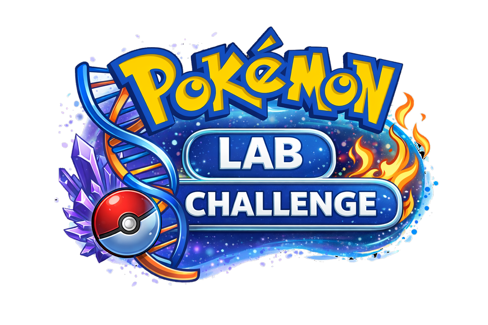
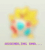

<p align="center">
  
</p>

<h1 align="center">Pokémon Lab Challenge</h1>

<p align="center">
  
  
  
</p>

<p align="center">
  Companion app for a custom Sacred Gold challenge: craft Pokémon via lab systems and event rewards.
</p>

<p align="center">
  <a href="https://github.com/lucaremix/pokemon-lab-challenge/releases/latest">
    
  </a>
  <a href="https://github.com/lucaremix/pokemon-lab-challenge/releases">
    
  </a>
</p>

---

## 🎮 How It Works

Progress through Sacred Gold and mark events as you complete them. Each win rewards you with crafting materials. Use those materials to build Pokémon, moves, and more.

### The Loop

```
Beat an event → Claim rewards → Craft moves & Pokémon → Download .pk4 → Import into PKHeX → Play
```

---

## 🗺️ Screens

### Map (`index.html`)
The Johto map with clickable event markers — gyms, rivals, Team Rocket encounters, special events. Each marker shows what rewards you'll get. Completed events turn grayscale.

<p align="center">
  
</p>

### DNA Machine (`machine.html`)
Two-phase Pokémon builder:

**Phase 1 — DNA Selection**
- Select Type DNA 1 and Type DNA 2 to filter the Pokémon pool by type
- Set BST and IV sliders (consumes BST DNA and IV DNA from inventory)
- Optionally use Shiny DNA or Legendary DNA for special results
- Hit **GENERATE** — costs 1 DNA Ball, picks a random Pokémon matching your filters
- The Pokémon appears blurred and distorted (identity hidden)

**Phase 2 — Genome Configuration**
<p align="center">
  
</p>

- Select Nature DNA, Ability Genome, and up to 4 moves (from your Move Machine creations)
- Hit **REVEAL** to unveil the Pokémon
- Hit **DOWNLOAD .PK4** to export — consumes Phase 2 items and generates the file

### Move Machine (`movemachine.html`)
Build custom moves using Cores:
- **Damage Cores** (Weak / Common / Epic / Legendary) → determine base power range
- **Class Cores** (Physical / Special) → determine damage class
- **Type Cores** → determine move type
- Mix and match — the machine randomly generates a move within the parameters

### DNA Melting Machine (`melting.html`)
Disassemble a created Pokémon to recover materials:
- Always drops **3 random items** (Type DNAs, Natures, or Genomes from the pool)
- **50% chance** to also recover the DNA Ball

### Bag (`inventory.html`)
Overview of all your current materials: DNA Balls, BST/IV DNA, Type DNAs, Natures, Cores, Genomes, created moves, and created Pokémon.

---

## 🧪 Crafting Materials

| Item | How you get it | Used for |
|------|----------------|----------|
| **DNA Ball** | Event rewards, Melting | One per Pokémon generation |
| **BST DNA** | Event rewards | Filter Pokémon by minimum BST |
| **IV DNA** | Event rewards | Total IVs distributed across 6 stats (cap 31 each) |
| **Type DNA** | Events, Melting | Filter Pokémon pool by type |
| **Nature DNA** | Events, Melting | Lock a specific nature |
| **Shiny DNA** | Special events | Force shiny result |
| **Legendary DNA** | Boss events | Access legendary Pokémon pool |
| **Damage Cores** (Weak/Common/Epic/Legendary) | Events, Melting | Move power tier |
| **Class Cores** (Physical/Special) | Events, Melting | Move damage class |
| **Type Cores** | Events, Melting | Move type |
| **Genomes** | Events, Melting | Ability pool for the Pokémon |

---

## 📦 .pk4 Export

The downloaded `.pk4` is a binary file in the exact format used by PKHeX for Gen 4. Import it via drag & drop in PKHeX.

What gets generated:
- Species, nickname, level 1
- Nature locked by your selection (or random if none selected)
- Ability chosen from the Genome pool
- IVs distributed randomly across all 6 stats, summing to exactly your IV input (cap 31 per stat)
- Up to 4 moves from your created move pool
- Shiny flag if Shiny DNA was used
- OT: `POKLAB`, game version: HeartGold

---

## 🛠️ Tech Stack

| Layer | Tech |
|-------|------|
| Backend | ASP.NET Core (.NET 10), C# |
| Frontend | Vanilla HTML/CSS/JS, Press Start 2P font |
| Pokémon file generation | [PKHeX.Core](https://github.com/kwsch/PKHeX) |
| Desktop wrapper | WPF + WebView2 |
| Data persistence | JSON files on disk (no database, no localStorage) |

---

## 🚀 Running the Project

### Option A — Desktop App (recommended)
Run `PUBBLICA.bat` to build both executables into `Game/`:

```
Game/
├── PokemonLabGame.exe   ← launch this
├── PokemonLab.exe       ← backend (auto-started)
└── wwwroot/
```

Double-click `PokemonLabGame.exe`. The server starts in the background and the app opens in a native window.

> **Requires:** WebView2 Runtime (pre-installed on Windows 11; free download for Windows 10)

### Option B — Browser
```bash
cd PokemonLab
dotnet run
```
Open `http://localhost:5000`

---

## 📁 Project Structure

```
PokemonLabChallenge/
├── assets/                         # GitHub README assets
│   ├── logo.png
│   └── map.png
├── PokemonLab/                     # ASP.NET Core backend
│   ├── Controllers/
│   │   └── DataController.cs       # REST API + .pk4 generator
│   ├── Program.cs
│   └── wwwroot/                    # Frontend (static files)
│       ├── index.html              # Johto map + events
│       ├── machine.html            # DNA Machine
│       ├── movemachine.html        # Move Machine
│       ├── melting.html            # Melting Machine
│       ├── inventory.html          # Bag
│       ├── data/
│       │   ├── inventory.json      # Player save data
│       │   ├── events.json         # Event definitions + completion state
│       │   ├── pokemon.json        # 242 craftable Pokémon
│       │   ├── moves.json          # 165 moves
│       │   └── genomes.json        # 13 ability genome pools
│       └── images/                 # ⚠️ not included — see below
├── PokemonLabGame/                 # WPF desktop wrapper
│   ├── MainWindow.xaml(.cs)        # WebView2 window
│   └── PokemonLabGame.csproj
├── PUBBLICA.bat                    # Build script → outputs to Game/
└── AVVIA.bat                       # Dev launcher (no recompile needed)
```

---

## 🖼️ Images (not included)

Images are not included in this repo due to Nintendo's IP. Add them yourself in `wwwroot/images/`:

```
images/
├── logo.png
├── map.png                         # Johto map
├── favicon.ico
├── ShinyCore.png
├── LegendaryCore.png
├── dna.png                         # Nav button icons
├── moves.png
├── melt.png
├── bag.png
├── balls/
│   └── dnaball.png
├── background/                     # Page backgrounds (optional)
│   ├── machine.png
│   ├── movemachine.png
│   ├── melting.png
│   └── inventory.png
├── cores/
│   ├── damagecore/                 # WeakCore, CommonCore, EpicCore, LegendaryCore
│   ├── classcore/                  # PhysicalCore, SpecialCore
│   └── typecore/                   # FireCore, WaterCore, ... (18 types)
├── typesdna/                       # Fire, Water, ... (18 types)
├── natures/                        # Adamant, Bold, ... (25 natures)
├── genomes/                        # GENOME_AEGIS, GENOME_APEX, ... (13 genomes)
└── tm/                             # Type icons for moves (Fire, Water, ...)
```

Pokémon sprites are loaded live from `pokemon.com`.

---

## 🔌 API

| Method | Endpoint | Description |
|--------|----------|-------------|
| `GET` | `/api/data/{file}.json` | Read any data file |
| `PUT` | `/api/data/inventory.json` | Save inventory state |
| `PUT` | `/api/data/events.json` | Save completed events |
| `POST` | `/api/data/pk4` | Generate and download a binary `.pk4` file |

---

## 📝 Credits

- ROM: **Sacred Gold** by [Drayano](https://x.com/Drayano60)
- Pokémon file format: [PKHeX](https://github.com/kwsch/PKHeX) by Kurt (kwsch)
- Pokémon © 1995–2026 Nintendo / Game Freak
